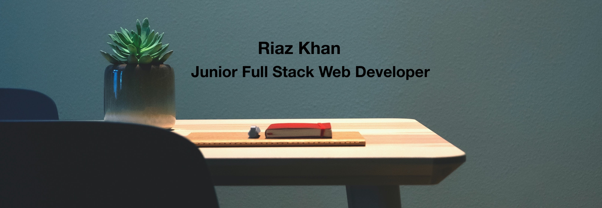

I believe the User is at the heart of Technology. The goal is to provide the best User experience. As a Jr. Full Stack Web Developer what I enjoy most about Web Development is the ability to establish connections, identify feedback loops, and implement concrete solutions. As a transitioning Counsellor, Web Development enables me to support and enrich communities across the globe.

- 🚀  I’m in the process of launching React Fitness Lite & Schnoodle
- 🌱  I’m currently learning Typescript
- 🔨  I’m looking for support with breaking into Tech Industry
- 🧨  Fun fact: I've been bungy jumping and sky diving!
- 📎  [Resume](https://resume.creddle.io/resume/izh3ulidt0f)
- 💼  [Portfolio](https://riazckhan.github.io/)

 

<!-- <h2 align="center">Language / Tools Section?</h2> -->

<!--
**RiazCKhan/riazckhan** is a ✨ _special_ ✨ repository because its `README.md` (this file) appears on your GitHub profile.
Here are some ideas to get you started:

- 👯 I’m looking to collaborate on ...
- 💬 Ask me about ...
- 📫 How to reach me: ...
- 😄 Pronouns: ...
-->
